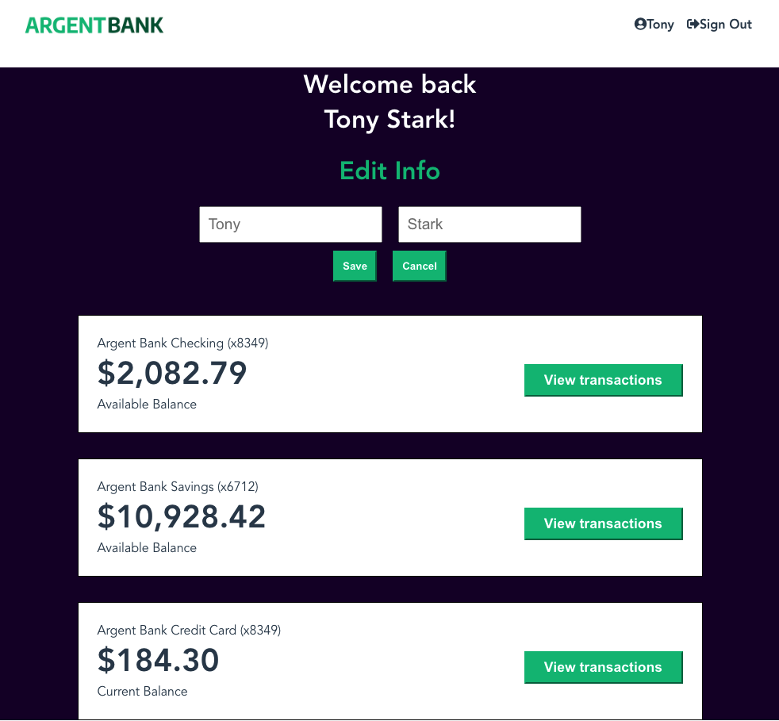

# ArgentBank

##### Projet 13 de la formation de developpeur Web Front End Javascript | React
------

### Tools Used in this project: 
- Redux Toolkit => Manage the data from the State dispatched in different components of my React App 
- API => Authentification and HTTP Requests to get and modify data in backend
- Swagger => Describe the structure of the API
- Postman => Create and Test HTTP requests that get the job done

#### LANCER LE PROJET
- Clone this backend [repo](https://github.com/OpenClassrooms-Student-Center/Project-10-Bank-API.git) and follow the instructions of its README file. Make sure it's running on your local machine by viewing [this swagger file](http://localhost:3001/api-docs/)
- In the root folder of the project, clone my [repo](https://github.com/MarieRodiet/argentBank-Front.git)
- `cd argentbank`
- `yarn install`
- `yarn run start`